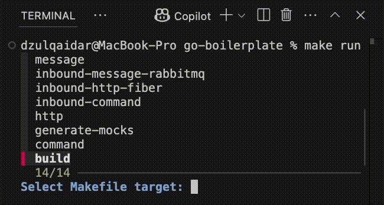

# Prabogo


**Prabogo** is a Go framework designed to simplify project development by providing an interactive command interface and built-in instructions for AI assistance. This framework streamlines common engineering tasks, making it easier for software engineers to scaffold, generate, and manage project components efficiently. With Prabogo, developers benefit from automation and intelligent guidance, accelerating the software development process.

## Design Docs

[Design Docs List](./design-docs)

## Requirement

1. go version >= go1.23.0

**Before running the app, copy the example environment file:**

```sh
cp .env.example .env
```

## Start External Services with Docker Compose

```sh
docker-compose up -d
```

## Stop External Services with Docker Compose

```sh
docker-compose down
```

## Run App in Development Mode

To run the application directly (without Makefile or Docker), ensure all required environment variables are set. You can use a `.env` file or export them manually.

Start the app with:

```sh
go run cmd/main.go <option>
```

Replace `<option>` with any command-line arguments your application supports. For example:

```sh
go run cmd/main.go http
```

Make sure external dependencies (such as PostgreSQL, RabbitMQ, and Redis) are running, either via Docker Compose or another method.

## Makefile Commands

The project includes a comprehensive Makefile with various helpful commands for code generation and development tasks.

### Interactive Command Runner



You can use the interactive target selector to choose and run Makefile targets:

```sh
make run
```

This will display an interactive menu to select a Makefile target and will prompt for any required parameters. The selector works in two modes:

1. If `fzf` is installed: Uses a fuzzy-search interactive selector (recommended for best experience)
2. If `fzf` is not available: Falls back to a basic numbered menu selection

To install `fzf` (optional):
- macOS: `brew install fzf`
- Linux: `apt install fzf` (Ubuntu/Debian) or `dnf install fzf` (Fedora)
- Windows: With chocolatey: `choco install fzf` or with WSL, follow Linux instructions

### Common Makefile Targets

#### Code Generation Targets

- `model`: Creates a model/entity with necessary structures (requires VAL parameter)
  ```sh
  make model VAL=name
  ```

- `migration-postgres`: Creates a PostgreSQL migration file (requires VAL parameter)
  ```sh
  make migration-postgres VAL=name
  ```

- `inbound-http-fiber`: Creates HTTP handlers using Fiber framework (requires VAL parameter)
  ```sh
  make inbound-http-fiber VAL=name
  ```

- `inbound-message-rabbitmq`: Creates RabbitMQ message consumers (requires VAL parameter)
  ```sh
  make inbound-message-rabbitmq VAL=name
  ```

- `inbound-command`: Creates command line interface handlers (requires VAL parameter)
  ```sh
  make inbound-command VAL=name
  ```

- `outbound-database-postgres`: Creates PostgreSQL database adapter (requires VAL parameter)
  ```sh
  make outbound-database-postgres VAL=name
  ```

- `outbound-http`: Creates HTTP adapter (requires VAL parameter)
  ```sh
  make outbound-http VAL=name
  ```

- `outbound-message-rabbitmq`: Creates RabbitMQ message adapter (requires VAL parameter)
  ```sh
  make outbound-message-rabbitmq VAL=name
  ```

- `outbound-cache-redis`: Creates Redis cache adapter (requires VAL parameter)
  ```sh
  make outbound-cache-redis VAL=name
  ```

- `generate-mocks`: Generates mock implementations from all go:generate directives in registry files
  ```sh
  make generate-mocks
  ```

#### Runtime Targets

- `build`: Builds the Docker image for the application
  ```sh
  make build
  # Force rebuild regardless of existing image:
  make build BUILD=true
  ```

- `http`: Runs the application in HTTP server mode inside Docker
  ```sh
  make http
  # Force rebuild before running:
  make http BUILD=true
  ```

- `message`: Runs the application in message consumer mode inside Docker (requires SUB parameter)
  ```sh
  make message SUB=upsert_client
  # Force rebuild before running:
  make message SUB=upsert_client BUILD=true
  ```

- `command`: Executes a specific command in the application (requires CMD and VAL parameters)
  ```sh
  make command CMD=publish_upsert_client VAL=name
  # Force rebuild before running:
  make command CMD=publish_upsert_client VAL=name BUILD=true
  ```

## Running test suite

### Unit tests

```sh
go test -cover ./internal/domain/...
```

To generate coverage report:

```sh
go test -coverprofile=coverage.profile -cover ./internal/domain/...
go tool cover -html coverage.profile -o coverage.html
```

Coverage report will be available at `coverage.html`

To check intermittent test failure due to mock. when in doubt, use `-t 1000`
```sh
retry -d 0 -t 100 -u fail -- go test -coverprofile=coverage.profile -cover ./internal/domain/... -count=1
```

## License

This project is licensed under the MIT License - see the [LICENSE](LICENSE) file for details.

## Author

Moch Dieqy Dzulqaidar